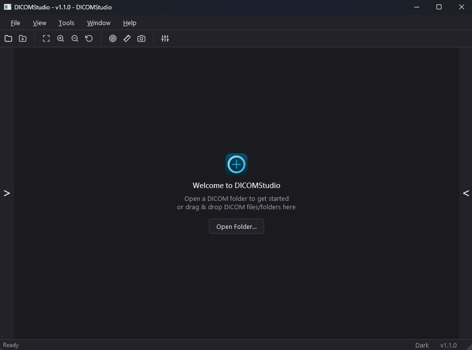
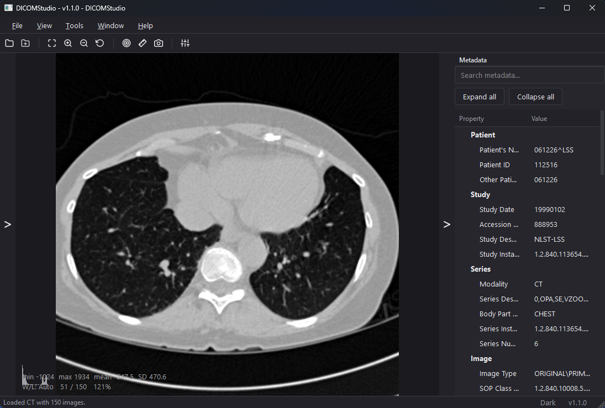
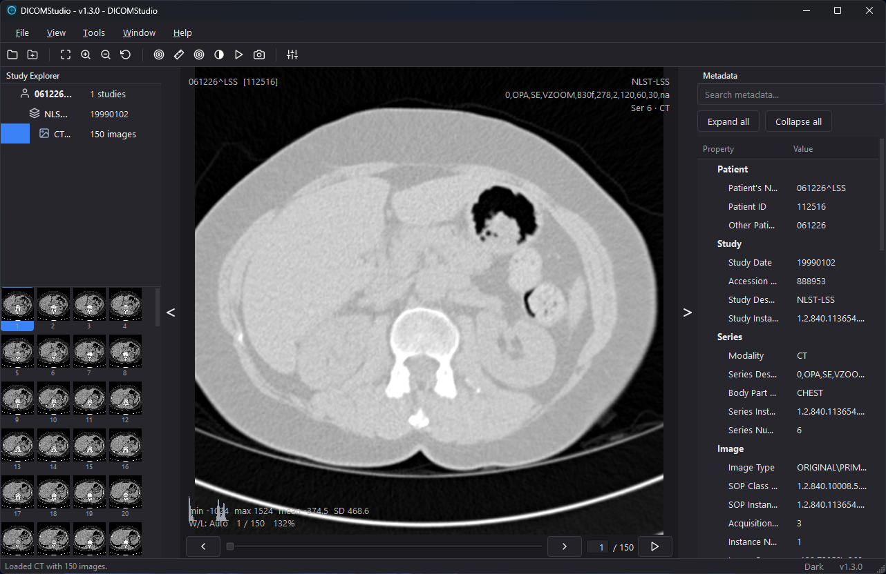

# DICOMStudio

**Modern Desktop DICOM Viewer for Medical Imaging**

DICOMStudio is a lightweight, professional desktop application for discovering,
organizing, and interacting with DICOM medical imaging studies on Microsoft
Windows. It is built with Python 3.13 and PySide6 (Qt 6) on a Clean
Architecture foundation, and is developed incrementally against a public
milestone roadmap.

[](https://www.python.org/)
[](https://doc.qt.io/qtforpython/)
[](https://pydicom.github.io/)
[](#)
[](LICENSE)

<p align="center">
  
</p>

> **Status:** Milestone 13 — UX & Workspace Foundation (v1.1.0)

---

## Overview

DICOM studies are rarely a single file — a study is a hierarchy of **Patient →
Study → Series → Images**, often spread across many files in a folder tree.
DICOMStudio is built around that hierarchy: point it at a folder, and it
recursively discovers the DICOM files inside, organizes them into their
proper study/series structure, and presents them in a navigable explorer
alongside a full-resolution image viewer and a searchable metadata panel.

DICOMStudio is **not** a PACS system and is **not** a certified clinical
diagnostic workstation. See [Scope & Disclaimer](#scope--disclaimer).

## Key Features

| Area | What it does |
| --- | --- |
| **Study Discovery** | Recursive, background folder scanning with header-only parsing and live progress; malformed or unrelated files are skipped gracefully. |
| **Study Explorer** | Patient / Study / Series / Image tree with modality, image counts, study dates, tooltips, and lazy thumbnail generation. |
| **Image Viewer** | Full-resolution DICOM pixel decoding, grayscale and RGB rendering, MONOCHROME1/2 inversion, Fit to Window, Actual Size, and Zoom In/Out. |
| **Window / Level** | Right-drag window/level adjustment, automatic reset, and one-click clinical presets (CT Brain, Stroke, Bone, Lung, Abdomen, Mediastinum, Soft Tissue, Temporal Bones). |
| **Navigation** | Mouse-wheel and keyboard slice navigation, panning, trackpad scrolling, and viewer shortcuts (F fit, R reset view, W reset window/level, M measure). |
| **Metadata Explorer** | Grouped, searchable DICOM header inspection with copy-to-clipboard for tags and values. |
| **Measurements** | Distance and angle measurement tools with per-slice overlays, using DICOM Pixel Spacing when available. |
| **Statistics & Histogram** | Pixel statistics (min/max/mean/std) and a live mini histogram per slice. |
| **Export** | PNG/JPEG export (Ctrl+S / Ctrl+E), screenshot capture, and copy-to-clipboard of the current view, including overlays. |
| **Workspace** | Persisted sidebar visibility and widths, fullscreen viewer mode (F11, Esc to exit), and drag & drop loading of folders or DICOM files. |
| **Settings & Themes** | Dark and light themes, configurable viewing defaults, render cache size, and a Recent Folders list. |
| **Windows Packaging** | Standalone build, Inno Setup installer with `.dcm` file association, and a portable zip — no Python required to run. |

## Screenshots

### Main Viewer

Full-resolution CT rendering with the Metadata panel open, showing the
window/level and pixel statistics overlay.

<p align="center">
  
</p>

### Study Explorer

Recursively-scanned folder organized into the Patient / Study / Series /
Image hierarchy.

<p align="center">
  
</p>

<!--
  ASSETS NEEDED (not yet available):
  - assets/screenshots/measurements.png — viewer with an active distance or
    angle measurement overlay.
  - assets/screenshots/settings.png — the Settings dialog (Appearance /
    Viewing / Measurements tabs).
-->

---

## Download

DICOMStudio is distributed as a Windows desktop application in two forms:

| Option | Best for | Notes |
| --- | --- | --- |
| **Installer** (`DICOMStudio-<version>-Setup.exe`) | Most users | Start Menu / desktop shortcuts, `.dcm` file association, clean uninstaller. |
| **Portable** (`DICOMStudio-<version>-Portable.zip`) | USB / no-install use | Extract and run `DICOMStudio.exe` directly; no installation or admin rights required. |

Both are built from the same frozen application — no Python installation is
required for either.

> **Get the latest build:** [Releases](../../releases/latest)
>
> *(If your repository does not yet publish GitHub Releases, build the
> installer and portable archive locally — see [Installation → For
> Developers](#for-developers) and `docs/build.md`.)*

## Installation

### For End Users

1. Download the latest installer or portable archive from
   [Releases](../../releases/latest).
2. **Installer:** run `DICOMStudio-<version>-Setup.exe` and follow the setup
   wizard. **Portable:** extract the zip anywhere and run `DICOMStudio.exe`.
3. Launch DICOMStudio from the Start Menu, desktop shortcut, or the extracted
   folder.
4. Open a folder of DICOM studies from **File → Open Folder** (`Ctrl+O`), or
   double-click a `.dcm` file if you used the installer.

See `docs/user/README.md` for the full installation guide.

### For Developers

Prerequisites: [uv](https://docs.astral.sh/uv/) and Python 3.13.

```powershell
git clone <repository-url>
cd dicomviewer
uv sync                              # create the environment and install deps
uv run python -m dicomviewer         # launch the application
```

Utility scripts (`scripts/`):

```powershell
.\scripts\dev.ps1               # sync the environment
.\scripts\run.ps1               # run the application
.\scripts\format.ps1            # format with Black
.\scripts\lint.ps1              # lint with Ruff
.\scripts\typecheck.ps1         # type check with Pyright
.\scripts\test.ps1              # run tests
.\scripts\build.ps1             # build Python distributions (wheel + sdist)
.\scripts\build_standalone.ps1  # build the standalone Windows application
.\scripts\build_portable.ps1    # build the portable zip archive
.\scripts\release.ps1           # full release: tests, standalone, installer, portable
```

## Quick Start / Usage

```powershell
uv run python -m dicomviewer --version      # print version and exit
uv run python -m dicomviewer --smoke-test   # launch, auto-exit (CI smoke test)
uv run python -m dicomviewer <folder>       # open a folder of DICOM studies
uv run python -m dicomviewer <file.dcm>     # open a DICOM file's folder
```

Once running: open a folder (`Ctrl+O`), expand a study in the Study Explorer,
and double-click a series or image to load it in the viewer. Right-drag
adjusts window/level, the mouse wheel navigates slices, and `Tools → Measure`
enables the measurement tools.

## How DICOMStudio Works

```
Open DICOM Folder
        ↓
Background Recursive Scan (header-only)
        ↓
Metadata Parsing & Validation
        ↓
Patient / Study / Series / Image Organization
        ↓
Full-Resolution Pixel Decoding
        ↓
Rendering Pipeline (rescale → VOI LUT/window-level → normalize → RGBA)
        ↓
Interactive Viewing (zoom, pan, measure, export)
```

## Architecture

DICOMStudio follows a four-layer Clean Architecture with a strict inward
dependency direction:

```
Presentation → Application → Domain ← Infrastructure
```

- **Presentation** — Qt windows, widgets, dialogs and view models.
- **Application** — use cases, workflows and coordination (framework-free).
- **Domain** — business rules, entities and exceptions (framework-free).
- **Infrastructure** — adapters for pydicom, tomlkit, loguru and the filesystem.

Dependencies are injected through a single composition root in
`src/dicomviewer/main.py`. No layer crosses architectural boundaries; the
Domain layer has no dependency on Qt or any I/O framework.

Detailed rationale for every major decision is recorded as an [Architecture
Decision Record](docs/architecture/README.md), covering topics such as
layering, dependency injection, background execution, logging, configuration,
error handling, versioning, testing strategy, theming, and Windows packaging.

## Technology Stack

| Concern | Tooling |
| --- | --- |
| Language | Python 3.13 |
| GUI | PySide6 (Qt 6) |
| DICOM | pydicom |
| Imaging | NumPy |
| Logging | Loguru |
| Config | TOML (tomlkit) |
| Testing | pytest |
| Formatting | Black |
| Linting | Ruff |
| Typing | Pyright (strict) |
| Packaging | uv / hatchling, PyInstaller, Inno Setup |

## Quality & Testing

- Unit, integration and smoke tests under `tests/`, run with `pytest`
  (`.\scripts\test.ps1`).
- Code formatting enforced with **Black**; linting with **Ruff**.
- **Strict** static typing across `src/` via Pyright (`tool.pyright` in
  `pyproject.toml`).
- Milestone 12 (Production Readiness) included a project-wide stability
  review across all four layers, with every finding covered by a regression
  test — see the [Changelog](CHANGELOG.md) for specifics.
- CI-ready workflow targeting Windows.

*(An exact automated test count is not tracked in this document — see the
`tests/` directory in the repository for the current suite.)*

## Project Structure

```
src/dicomviewer/     application source (presentation / application / domain / infrastructure / shared)
tests/               unit, integration and smoke tests
docs/                project documentation and Architecture Decision Records
config/              configuration reference material
resources/           runtime-bundled assets (icons, styles, application icon)
assets/              repository-only media (branding, screenshots)
packaging/            Windows packaging (PyInstaller spec, Inno Setup script, icon)
scripts/             reproducible development and release workflows
```

## Documentation

- [`docs/user/README.md`](docs/user/README.md) — end-user installation guide.
- [`docs/architecture/README.md`](docs/architecture/README.md) — Architecture
  Decision Records.
- [`docs/build.md`](docs/build.md) — build and release process.
- [`IMPLEMENTATION_ROADMAP.md`](IMPLEMENTATION_ROADMAP.md) — the twelve
  development milestones and release strategy.
- [`CODING_STANDARDS.md`](CODING_STANDARDS.md) — mandatory coding conventions.
- [`UI_BLUEPRINT.md`](UI_BLUEPRINT.md) — user interface design specification.

Internal process documents (`PROJECT_CONSTITUTION.md`,
`AI_DEVELOPMENT_RULES.md`, `MILESTONE_PROMPT_FRAMEWORK.md`) remain in the
repository for contributors but are intentionally not the focus of this page.

## Roadmap

### Completed (through v1.0.1)

- Application shell, docking workspace, and theming
- DICOM discovery, background scanning, and study organization
- Full-resolution image viewing, window/level, zoom/pan, slice navigation
- Diagnostic image processing: clinical presets, statistics, histogram
- Metadata explorer with search and clipboard actions
- Distance and angle measurement tools
- PNG/JPEG export, screenshot capture, and clipboard copy
- Settings, themes, and Recent Folders
- Performance optimization pass (thumbnail generation, combined analysis)
- Windows packaging: standalone build, installer, and portable archive
- Production readiness review and rebrand to DICOMStudio

### Planned / Future

The project constitution frames DICOMStudio as a foundation intended to
evolve toward a broader medical imaging platform (for example PACS
connectivity, multi-planar reconstruction, 3D rendering, and AI-assisted
analysis). None of these capabilities are implemented as of v1.0.1; consult
`IMPLEMENTATION_ROADMAP.md` for the authoritative, milestone-by-milestone plan
before relying on any future-facing claim.

## Scope & Disclaimer

DICOMStudio is an open-source desktop DICOM viewer. It is **not** a Picture
Archiving and Communication System (PACS), does not provide DICOM network
services (such as C-STORE/C-FIND/DICOMweb) unless and until a specific
milestone adds and documents them, and is **not** a certified medical device
or a validated clinical diagnostic workstation. Do not use DICOMStudio as the
sole basis for clinical diagnosis or patient care decisions.

## Contributing

1. Fork and clone the repository.
2. Create a feature branch.
3. Set up the environment with `uv sync`.
4. Make your changes, following `CODING_STANDARDS.md`.
5. Run the checks before submitting:
   ```powershell
   .\scripts\format.ps1
   .\scripts\lint.ps1
   .\scripts\typecheck.ps1
   .\scripts\test.ps1
   ```
6. Open a pull request describing the change.

## License

MIT — see [LICENSE](LICENSE).
